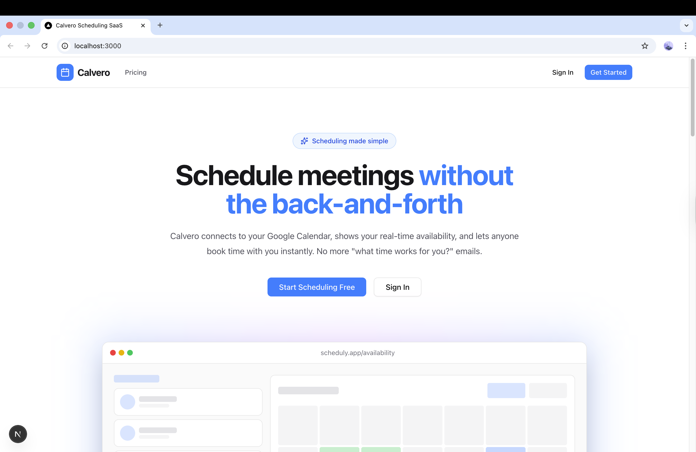
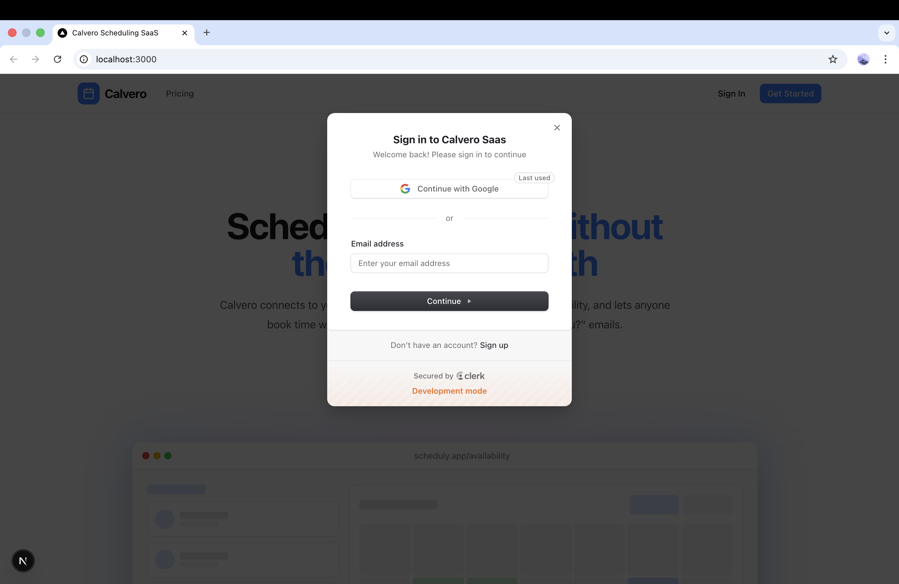
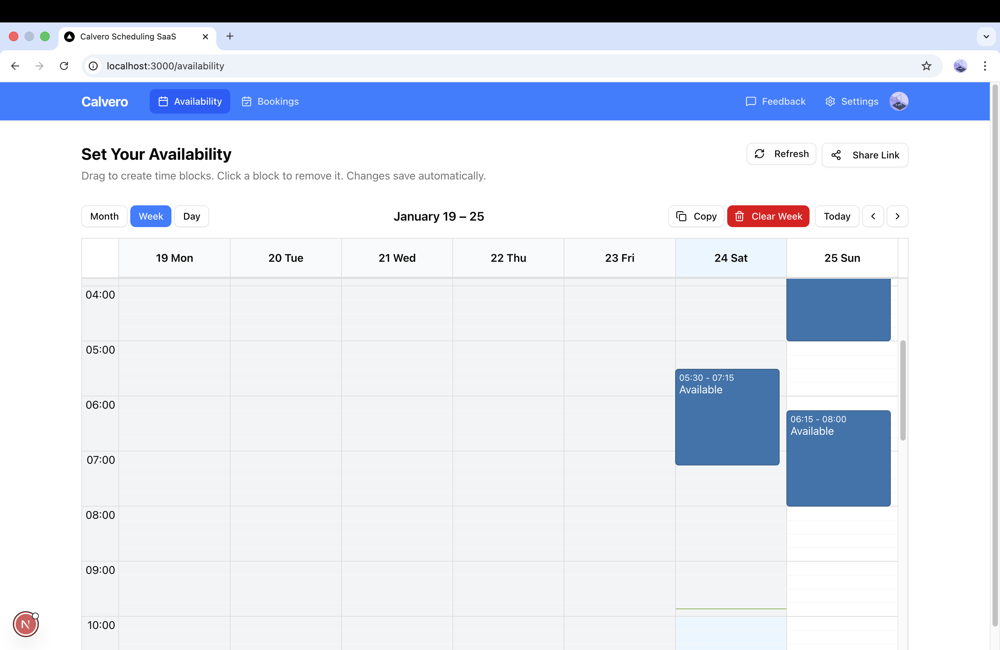
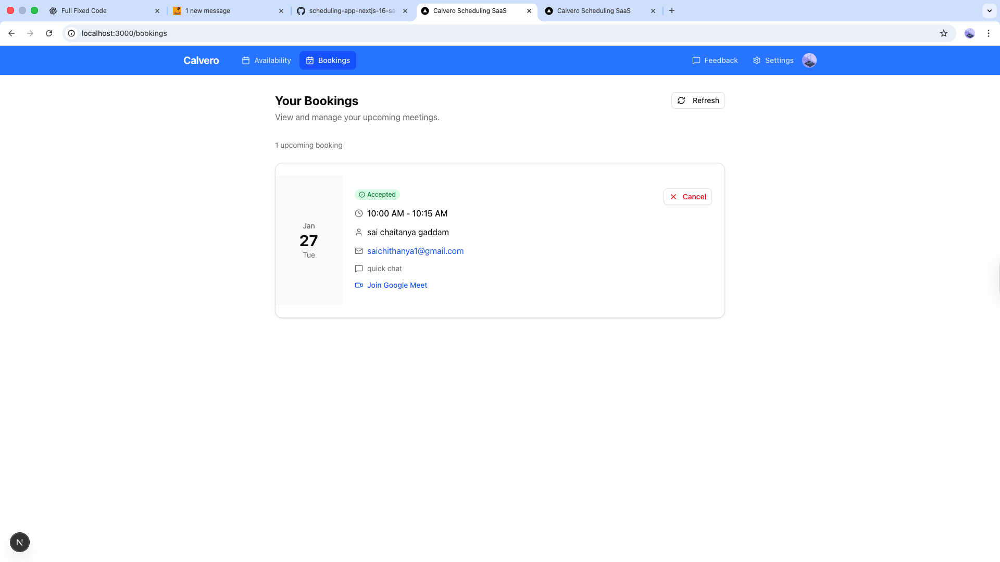
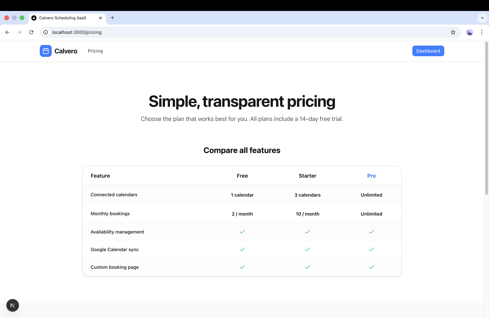
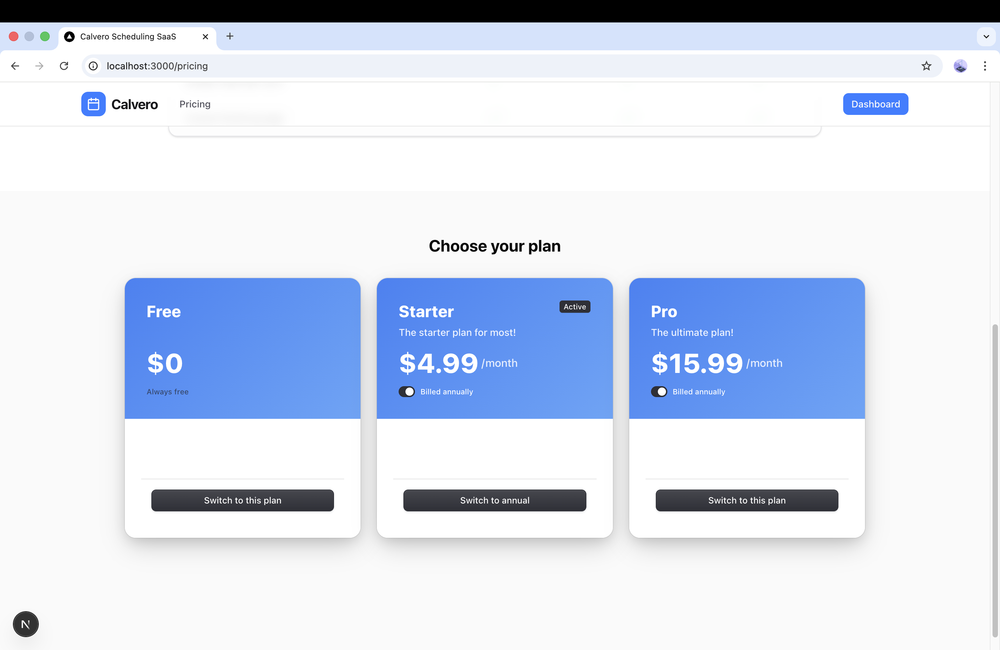
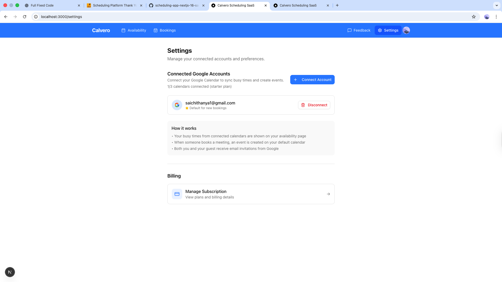

# Calvero

## 📅 What Is This App?

Think of **Calvero** as your personal scheduling assistant —  
but one that never sleeps and never double-books you.

It handles availability, bookings, and calendar sync automatically so you can focus on the meeting, not the logistics.

---

## 🛠️ Tech Stack

- **Next.js**
- **TypeScript**
- **Clerk** (Authentication)
- **Sanity** (CMS)
- **Tailwind CSS**
- **Vercel** (Deployment)

---

## ✨ Features

### 👥 For End Users

| Feature | Description |
|------|-------------|
| 📅 **Smart Availability** | Drag-and-drop calendar to set when you're free for meetings |
| 🔄 **Google Calendar Sync** | Connect multiple Google accounts to prevent double-booking |
| 🎥 **Automatic Google Meet** | Every booking generates a video call link automatically |
| ⏱️ **Flexible Meeting Types** | Create 15, 30, 45, 60, or 90-minute meeting options |
| 🌍 **Timezone Intelligence** | Guests see availability in their local timezone |
| ✅ **Real-time Status** | Track who accepted, declined, or hasn't responded |
| 🔗 **Shareable Booking Pages** | Clean URLs like `/book/your-name/consultation` |

---

### ⚙️ Technical Features (The Smart Stuff)

| Feature | Description |
|------|-------------|
| ⚡ **Next.js 16 App Router** | Built with React 19 & Server Components |
| 🔐 **Clerk Auth + Billing** | Authentication and subscription management in one |
| 📊 **Sanity CMS** | Real-time data with embedded Studio at `/studio` |
| 🔑 **OAuth2 Token Refresh** | Automatic handling of expired Google tokens |
| 💰 **Tiered Pricing** | Free, Starter, and Pro subscription plans |
| 📈 **Admin Dashboard** | Insights, analytics, and feedback management |
| 🎨 **shadcn/ui** | Beautiful, accessible, and composable UI components |

## 👤 For Hosts (You)

- **Set your availability**  
  Use a visual calendar to drag and create time blocks when you're free for meetings.

- **Connect your Google Calendar**  
  Calvero reads your existing events so it never shows time slots when you're already busy.

- **Create meeting types**  
  Define different kinds of meetings:
  - 15-min quick chat
  - 30-min consultation
  - 60-min deep dive

- **Share your booking link**  
  Send `yoursite.com/book/your-name` to anyone who wants to meet.

---

## 🙋 For Guests (People Booking With You)

- Visit your public booking page
- See **only the times you're actually available**
- Pick a slot and enter their name & email
- Automatically receive a **Google Calendar invite with a Google Meet link**

---

## 🎯 Perfect For

- Freelancers scheduling client calls
- Consultants managing discovery sessions
- Coaches & tutors booking 1-on-1 sessions
- Developers learning how to build SaaS products

---

## 🖼️ Screenshots

### Home Page

### Sign In

### Availability Management

### Bookings Page

### Pricing Pages

### Settings

---

## 🚀 Live Demo

